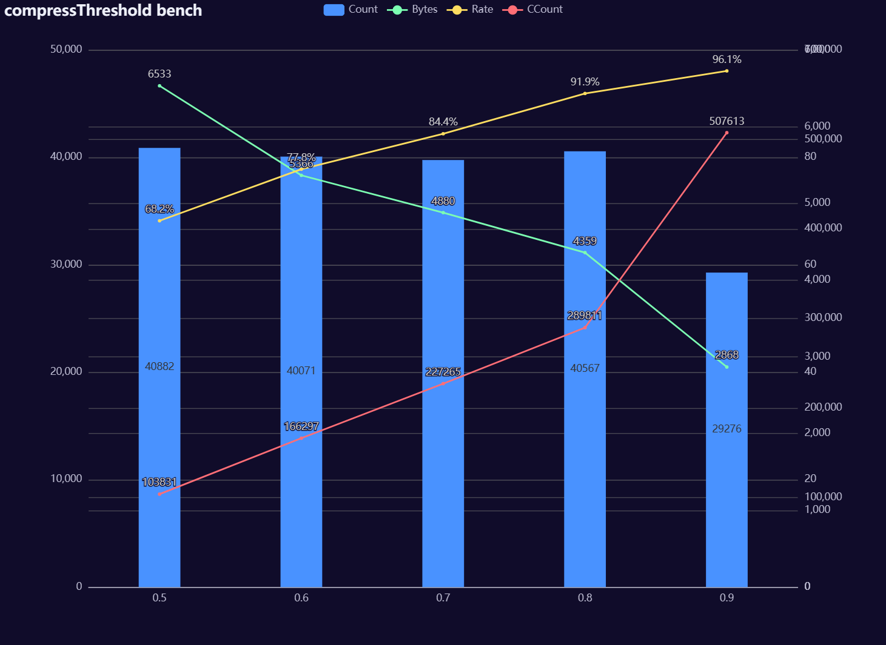
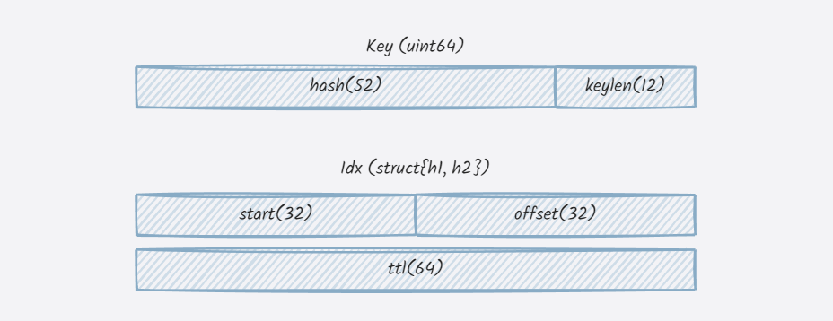
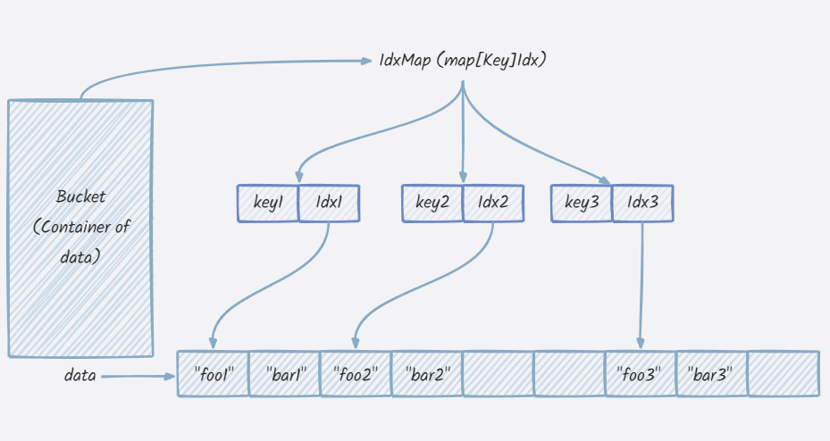

# GigaCache

[](https://goreportcard.com/report/github.com/xgzlucario/GigaCache) [](https://pkg.go.dev/github.com/xgzlucario/GigaCache)   [](https://codecov.io/gh/xgzlucario/GigaCache) [](https://github.com/xgzlucario/GigaCache/actions/workflows/rotom.yml)

GigaCache is a Golang cache built on `swissmap`, designed to manage GB-level caches with better performance, and higher memory efficiency than `built-in map`, multi-threaded support, 0 GC overhead.

[See doc here](https://www.yuque.com/1ucario/devdoc/ntyyeekkxu8apngd?singleDoc)

# 🚗Usage

**Install**

```bash
go get github.com/xgzlucario/GigaCache
```

**Example**

```go
package main

import (
    "fmt"
    cache "github.com/xgzlucario/GigaCache"
)

func main() {
    m := cache.New()

    m.Set("foo", []byte("bar"))
    // Set with expired time.
    m.SetEx("foo1", []byte("bar1"), time.Minute)
     // Set with deadline.
    m.SetTx("foo2", []byte("bar2"), time.Now().Add(time.Minute).UnixNano())

    val, ts, ok := m.Get("foo")
    fmt.Println(string(val), ok) // bar, (nanosecs), true

    ok := m.Has("foo1") // true
    if ok { 
        // ...
    }

    ok := m.Delete("foo1") // true
    if ok { 
        // ...
    }

    // or Range cache
    m.Scan(func(key []byte, val []byte, ts int64) bool {
        // ...
        return true
    })

    m.Keys() // ["foo", "foo2"]
}
```

# 🚀Benchmark

**Environment**

```
goos: linux
goarch: amd64
pkg: github.com/xgzlucario/GigaCache
cpu: 13th Gen Intel(R) Core(TM) i5-13600KF
```

**Set**

Gigache Set operation has better performance than stdmap.

| Benchmark        | Iter    | time/op     | bytes/op | alloc/op    |
| ---------------- | ------- | ----------- | -------- | ----------- |
| Set/stdmap-20    | 4457132 | 296.9 ns/op | 183 B/op | 1 allocs/op |
| Set/GigaCache-20 | 6852141 | 216.9 ns/op | 146 B/op | 1 allocs/op |

**Get** from 100k entries.

| Benchmark        | Iter     | time/op     | bytes/op | alloc/op    |
| ---------------- | -------- | ----------- | -------- | ----------- |
| Get/stdmap-20    | 22750813 | 52.25 ns/op | 7 B/op   | 0 allocs/op |
| Get/GigaCache-20 | 20830256 | 52.62 ns/op | 8 B/op   | 1 allocs/op |

**Delete**

| Benchmark              | Iter     | time/op     | bytes/op | alloc/op    |
| ---------------------- | -------- | ----------- | -------- | ----------- |
| Delete/stdmap-20       | 87499602 | 14.53 ns/op |	7 B/op	 | 0 allocs/op |
| Delete/GigaCache-20    | 22143832 | 49.78 ns/op |	8 B/op	 | 1 allocs/op |

**Iter** from 100k entries.

| Benchmark                   | Iter     | time/op       | bytes/op | alloc/op    |
| --------------------------- | -------- | ------------- | -------- | ----------- |
| BenchmarkIter/stdmap-20     |      496 | 2451833 ns/op |	 0 B/op	| 0 allocs/op |
| BenchmarkIter/GigaCache-20  |     1998 |  579076 ns/op |	 0 B/op | 0 allocs/op |

# 🎢Integrated Bench

Run bench with `go run example/*.go`.

In the comprehensive test scenario (20 million entries inserted), GigaCache is significantly ahead of stdmap in terms of memory efficiency and faster insertion, but gc performance is slightly worse than stdmap.

```go
gigacache
entries: 20000000
alloc: 1121 mb
gcsys: 32 mb
heap inuse: 1121 mb
heap object: 1061 k
gc: 18
pause: 978.578µs
cost: 12.879543968s
```

```go
stdmap
entries: 20000000
alloc: 2663 mb
gcsys: 64 mb
heap inuse: 2664 mb
heap object: 29482 k
gc: 11
pause: 648.029µs
cost: 14.195488627s
```

# 🛸Internal

GigaCache structure.



Key & Idx Defination.



Bucket structure.


