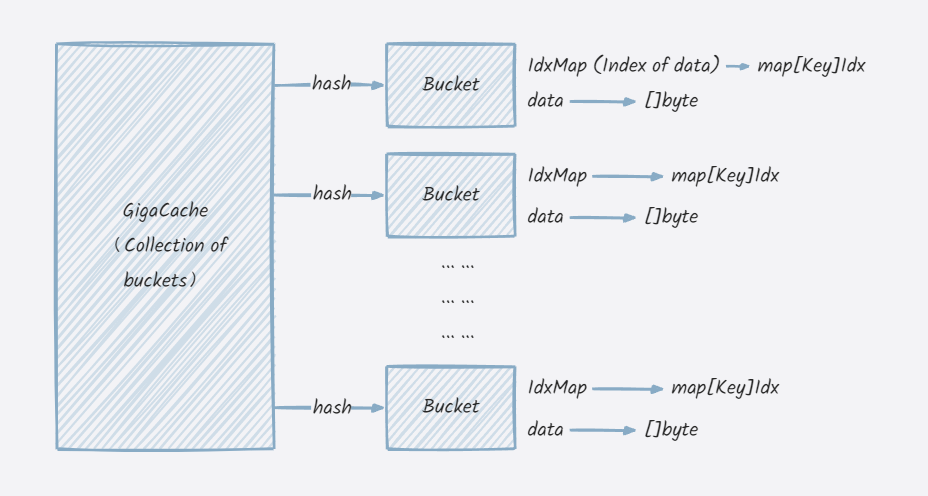
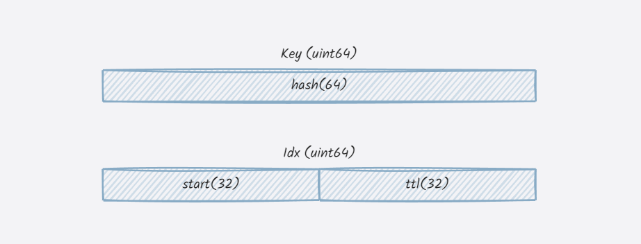

# GigaCache

[](https://goreportcard.com/report/github.com/xgzlucario/GigaCache) [](https://pkg.go.dev/github.com/xgzlucario/GigaCache)   [](https://codecov.io/gh/xgzlucario/GigaCache) [](https://github.com/xgzlucario/GigaCache/actions/workflows/rotom.yml)

GigaCache 是一个基于 `swissmap` 的高性能 Go 缓存库，为 GB 级序列化数据而设计，支持设置过期时间与淘汰机制，相比 `stdmap` 有更快的速度，更高的内存效率，和更小的延迟。

特性：

1. 只支持序列化的数据，性能超强，插入性能相比 `stdmap` 提升了 **93%**，内存使用减少 **50%**。
2. 采用分片技术减小锁粒度，并分块管理数据
3. 键值对独立的过期时间支持，使用定期淘汰策略驱逐过期的键值对
4. 内置迁移算法，定期整理碎片空间，以释放内存
5. 类似于 `bigcache` 规避 GC 的设计，上亿数据集的 P99 延迟在微秒级别

你可以阅读 [博客文档](https://lucario.cn/posts/gigacache/) 了解更多的技术细节。

# 性能

下面是插入 2000 万条数据的性能对比测试，`GigaCache` 的插入速度相比 `stdmap` 提升了 **93%**，内存使用相比也减少了 **50%** 左右。

```
gigacache
entries: 20000000
alloc: 1327 mb
gcsys: 7 mb
heap inuse: 1327 mb
heap object: 5033 k
gc: 12
pause: 2.348011ms
cost: 10.903936565s
```

```
stdmap
entries: 20000000
alloc: 2702 mb
gcsys: 16 mb
heap inuse: 2709 mb
heap object: 29596 k
gc: 11
pause: 2.564445ms
cost: 21.102264031s
```

**详细测试**

```
goos: linux
goarch: amd64
pkg: github.com/xgzlucario/GigaCache
cpu: 13th Gen Intel(R) Core(TM) i5-13600KF
BenchmarkSet/stdmap-20                      3978168              360.2 ns/op           225 B/op          3 allocs/op
BenchmarkSet/cache-20                       5956052              234.2 ns/op            95 B/op          2 allocs/op
BenchmarkSet/cache/disableEvict-20          7046114              214.1 ns/op           104 B/op          2 allocs/op
BenchmarkGet/stdmap-20                      8696785              152.5 ns/op            15 B/op          1 allocs/op
BenchmarkGet/cache-20                       8866696              131.2 ns/op            16 B/op          2 allocs/op
BenchmarkScan/stdmap-20                         151            7814006 ns/op             0 B/op          0 allocs/op
BenchmarkScan/cache-20                          100           11475189 ns/op             0 B/op          0 allocs/op
BenchmarkScan/cache/disableEvict-20             288            4273882 ns/op             0 B/op          0 allocs/op
BenchmarkRemove/stdmap-20                  16358985              66.26 ns/op            16 B/op          1 allocs/op
BenchmarkRemove/cache-20                    7386679              151.4 ns/op            16 B/op          2 allocs/op
BenchmarkMigrate/stdmap-20                      676            1739740 ns/op       6441224 B/op       1685 allocs/op
BenchmarkMigrate/cache-20                       343            3561328 ns/op         24620 B/op       1024 allocs/op
BenchmarkMigrate/cache/parallel-20              973            1118931 ns/op         42541 B/op       2092 allocs/op
BenchmarkIdx/newIdx-20                   1000000000             0.7566 ns/op             0 B/op          0 allocs/op
BenchmarkIdx/newIdxx-20                  1000000000             0.3761 ns/op             0 B/op          0 allocs/op
PASS
```

**测试环境**

```
goos: linux
goarch: amd64
pkg: github.com/xgzlucario/GigaCache
cpu: AMD Ryzen 7 5800H with Radeon Graphics
```

# 使用

首先安装 GigaCache 到本地：

```bash
go get github.com/xgzlucario/GigaCache
```

运行下面的代码示例：

```go
package main

import (
    "fmt"
    cache "github.com/xgzlucario/GigaCache"
)

func main() {
    m := cache.New(cache.DefaultOptions)

    m.Set("foo", []byte("bar"))
    // Set with expired time.
    m.SetEx("foo1", []byte("bar1"), time.Minute)
     // Set with deadline.
    m.SetTx("foo2", []byte("bar2"), time.Now().Add(time.Minute).UnixNano())

    val, ts, ok := m.Get("foo")
    fmt.Println(string(val), ok) // bar, (nanosecs), true

    ok := m.Delete("foo1") // true
    if ok { 
        // ...
    }

    // or Range cache
    m.Scan(func(key, val []byte, ts int64) bool {
        // ...
        return false
    })
}
```

# 内部架构

GigaCache



Key & Idx



Bucket


